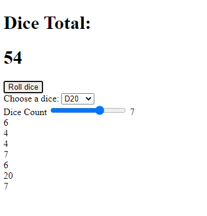

# Simple Dice Roller Webpage Demo

This project is just a basic demo for students to see how JavaScript can interact with HTML.

The dice roll system shown in the code is based on the Dungeons & Dragons dice system, showing dice ranges appropriate to that game.

    

Visit this link to see the interactive project deployed on Github Pages:
[https://alexstormwood.github.io/SimpleDiceRoller/src/index.html](https://alexstormwood.github.io/SimpleDiceRoller/src/index.html)
